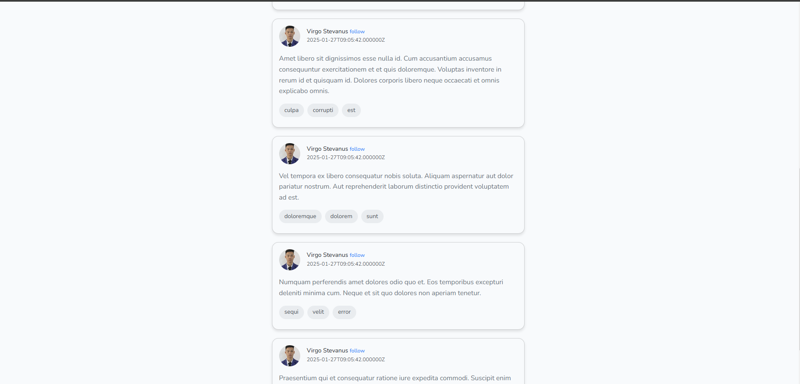
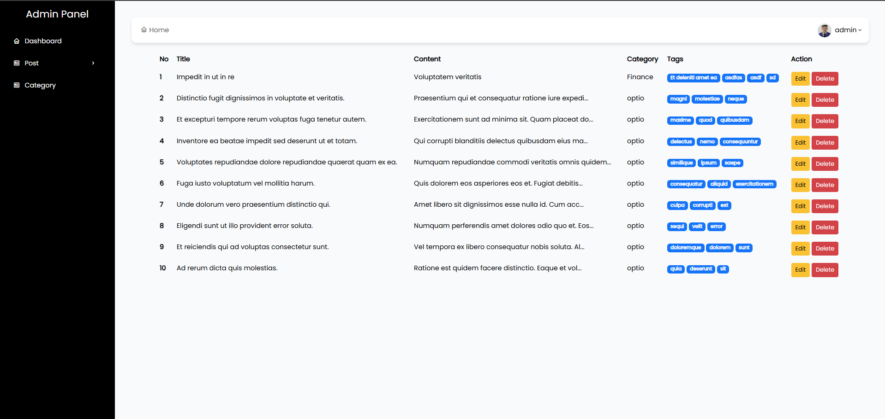

# Personal Blog Management App




## Description
The Personal Blog Management App is a web application designed to showcase my blog posts and provide a seamless way to manage them. It includes a user-friendly blog display for readers and an admin dashboard where you can easily manage categories and posts. This project was built using Laravel 11 and Bootstrap 5 for a clean and responsive design.

## Features

### Public Blog
- View all blog posts with a clean and responsive layout.
- Search and filter blog posts by categories and tags. (SOON)

### Admin Dashboard
- **Category Management**
  - Add new categories.
  - Edit existing categories.
  - Delete categories.
- **Post Management**
  - Add new posts with title, content, and category assignment.
  - Edit existing posts.
  - Delete posts.

## Technology Stack
- **Framework**: Laravel 11
- **Frontend**: Bootstrap 5
- **Database**: MySQL

## Installation

To set up the project locally, follow these steps:

### Prerequisites
- PHP 8.1 or higher
- Composer
- Node.js and npm
- MySQL

### Steps
1. **Clone the repository**
   ```bash
   git clone https://github.com/Virgo-SSS/personal-blog.git
   cd personal-blog
   ```

2. **Install dependencies**
   ```bash
    composer install
    npm install
    ```

3. **Create a new MySQL database**
    - Create a new MySQL database using your preferred tool (e.g., phpMyAdmin, MySQL Workbench).
    - Note the database name, username, and password for the next step.

4. **Configure the environment file**
    - Copy the .env.example file and rename it to .env, then update the following fields:
    ```bash
    DB_CONNECTION=mysql
    DB_HOST=127.0.0.1
    DB_PORT=3306
    DB_DATABASE=your_database_name
    DB_USERNAME=your_database_username
    DB_PASSWORD=your_database_password
    ```

5. **Generate a new application key**
    ```bash
    php artisan key:generate
    ```
6. **Run the database migrations**
    ```bash
    php artisan migrate
    ```
7. **Seed the database with sample data**
    ```bash
    php artisan db:seed
    ```

8. **Start the development server**
    ```bash
    php artisan serve
    ```

9. **Compile assets**
    - Open a new terminal window and run the following command to compile the assets.
    ```bash
    npm run dev
    ```

10. **Access the application**
    - Open your browser and go to `http://localhost:8000`.

